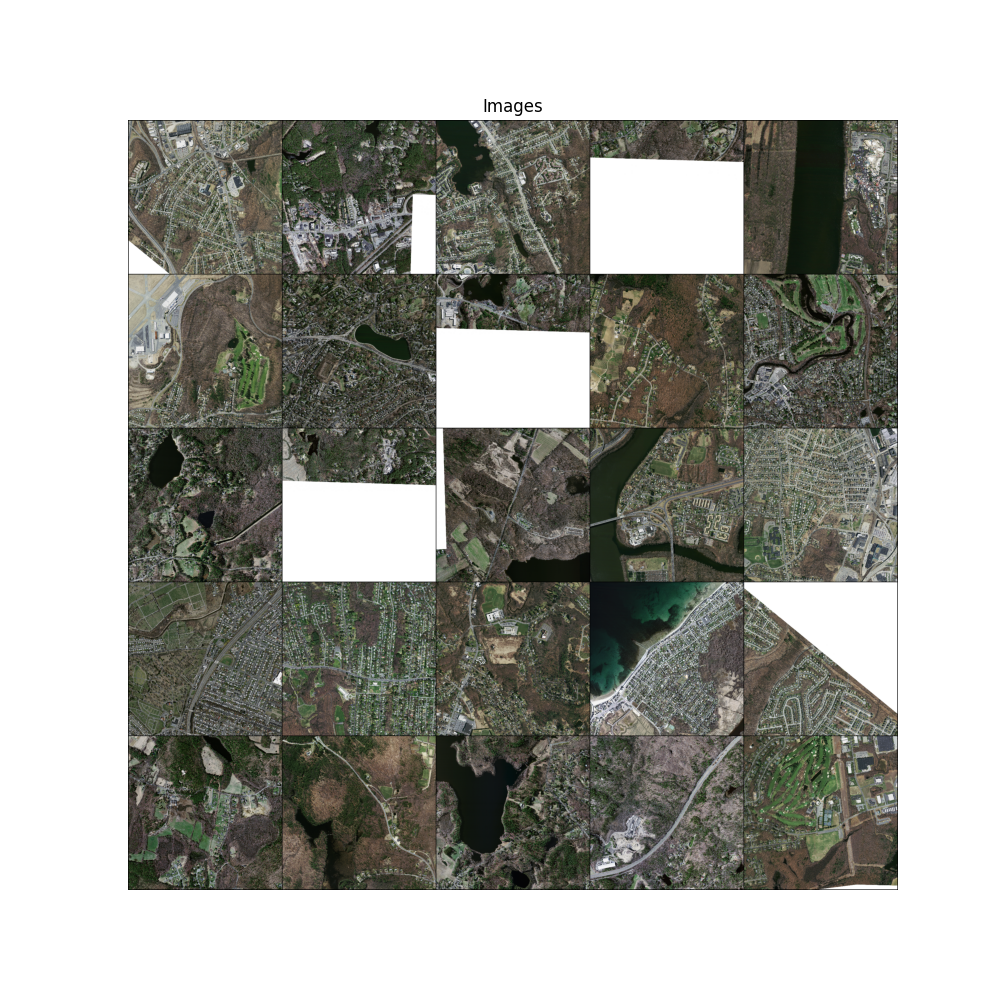
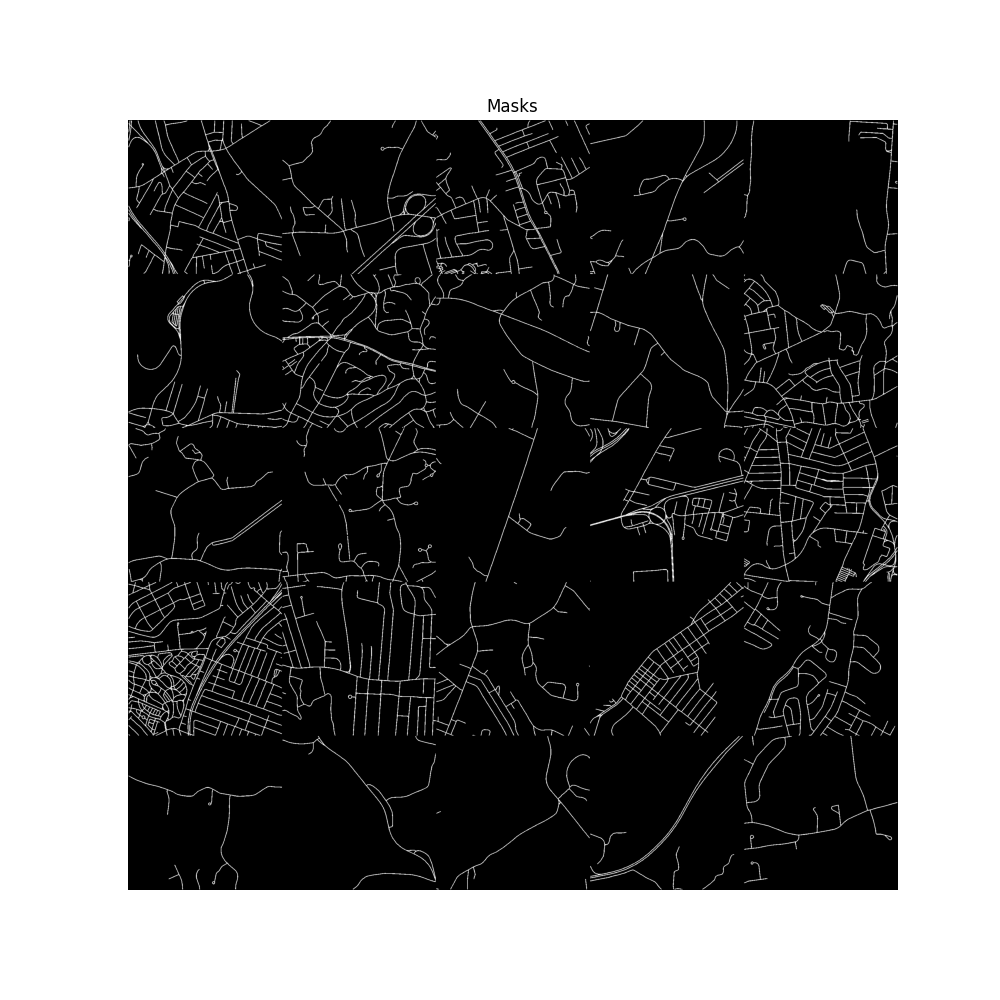

# Aerial Image Segmentation with the Massachusetts Roads Dataset (Subset)




This repository contains a pipeline for aerial image segmentation using a subset of 200 images and their corresponding masks from the [Massachusetts Roads Dataset](https://www.cs.toronto.edu/~vmnih/data/). Each aerial image is 1500×1500 pixels, covering an area of 2.25 square kilometers. The goal is to train a deep learning model (e.g., `RoadSegModel`) to segment roads in aerial images, validate its performance, and generate predictions on test data.

After completing this project with the subset, you can apply the same pipeline to the full dataset (1171 images) for more extensive experimentation.

## Table of Contents

- [Project Overview](#project-overview)
- [Dataset](#dataset)
- [Installation](#installation)
- [Usage](#usage)
- [Directory Structure](#directory-structure)
- [Dependencies](#dependencies)
- [Acknowledgements](#acknowledgements)
- [License](#license)
- [Contributing](#contributing)
- [Contact](#contact)

## Project Overview

This project implements an end-to-end pipeline for aerial image segmentation:

- **Data Preparation**: Splits the dataset into training, validation, and test sets.
- **Training**: Trains a segmentation model using PyTorch.
- **Validation**: Evaluates the model on a validation set using metrics like IoU and Dice.
- **Inference**: Generates segmentation masks on test images.

The pipeline is modular, with separate components for training (`Trainer`), validation (`Evaluator`), and prediction (`Predictor`), orchestrated via a `Makefile` for ease of use.

## Dataset

The dataset is a subset of the Massachusetts Roads Dataset, containing:

- 200 aerial images (`data/images/`).
- 200 corresponding binary masks (`data/masks/`).
- A CSV file mapping images to masks (`data/train.csv`).

Each image is 1500×1500 pixels, covering 2.25 square kilometers. The full dataset (1171 images) is available at [https://www.cs.toronto.edu/~vmnih/data/](https://www.cs.toronto.edu/~vmnih/data/).

## Installation

### Prerequisites

- Python 3.8+
- [Poetry](https://python-poetry.org/) for dependency management
- [Make](https://www.gnu.org/software/make/) for task automation
- A compatible system (Linux, macOS, or Windows with WSL/Git Bash)

### Steps

1. Clone the repository:

   ```bash
   git clone https://github.com/benintw/aerial_image_seg.git
   cd aerial_image_seg
   ```

2. Install dependencies:
   ```bash
   poetry install
   ```

## Usage

The project uses a Makefile to automate tasks. Below are the main commands:

1. Download the Dataset
   Download the dataset from the Massachusetts Roads Dataset:

   ```bash
   make download_dataset
   ```

2. Split the Dataset
   Split data/train.csv into training, validation, and test sets (70%/15%/15% by default):

   ```bash
   make split_data
   ```

   Output: data/splits/train_split.csv, data/splits/val_split.csv, data/splits/test_split.csv.

3. Train the Model
   Train the RoadSegModel on the training set:

   ```bash
   make train
   ```

   Config: configs/training.yaml (override with make train TRAIN*CONFIG=configs/custom.yaml).
   Output: Checkpoints in checkpoints/, logs in logs/train*\*.log, training history plots in logs/.

4. Validate the Model
   Evaluate the model on the validation set:

   ```bash
   make validate
   ```

   Config: configs/validation.yaml (override with make validate VAL*CONFIG=configs/custom.yaml).
   Output: Validation metrics in logs/validate*\*.log, visualizations in predictions/.

5. Predict on Test Set
   Generate segmentation masks on the test set:

   ```bash
   make predict
   ```

   Config: configs/inference.yaml (override with make predict PRED_CONFIG=configs/custom.yaml).
   Output: Predicted masks in predictions/, logs in logs/predict\*\*.log.

6. Run All Steps
   Execute the entire pipeline from start to finish:

   ```bash
   make all
   ```

   This will split the data, train the model, validate it, and generate predictions.

7. Clean Generated Files
   Remove logs, checkpoints, predictions, and split data:

   ```bash
   make clean
   ```

## Directory Structure

```bash
aerial_image_seg/
├── configs/               # Configuration files (training.yaml, validation.yaml, inference.yaml)
├── data/                 # Dataset
│   ├── images/           # Aerial images
│   ├── masks/            # Segmentation masks
│   ├── splits/           # Split CSVs (train_split.csv, val_split.csv, test_split.csv)
│   └── train.csv         # Original mapping of images to masks
├── scripts/              # Shell and Python scripts for tasks
│   ├── download_data.py
│   ├── split_data.py
│   ├── train.py
│   ├── validate.py
│   ├── predict.py
│   └── *.sh
├── src/                  # Source code
│   ├── data/             # Data loading and dataset classes
│   ├── inference/        # Prediction logic (Predictor)
│   ├── models/           # Model definitions (RoadSegModel)
│   ├── training/         # Training and evaluation logic (Trainer, Evaluator)
│   └── utils/            # Utilities (logging, metrics, visualization)
├── logs/                 # Training, validation, and prediction logs
├── checkpoints/          # Model checkpoints
├── predictions/          # Predicted segmentation masks
├── Makefile              # Task automation
└── README.md             # Project documentation
```

## Dependencies

Python Libraries: Managed via Poetry (see pyproject.toml).

- PyTorch
- torchvision
- pandas
- scikit-learn
- matplotlib
- tqdm

Tools:

- Poetry
- Make

## Acknowledgements

This project uses a subset of the Massachusetts Roads Dataset, introduced by Volodymyr Mnih in Chapter 6 of his PhD thesis. If you use this dataset for research, please cite:

```bibtex
@phdthesis{MnihThesis,
    author = {Volodymyr Mnih},
    title = {Machine Learning for Aerial Image Labeling},
    school = {University of Toronto},
    year = {2013}
}
```
